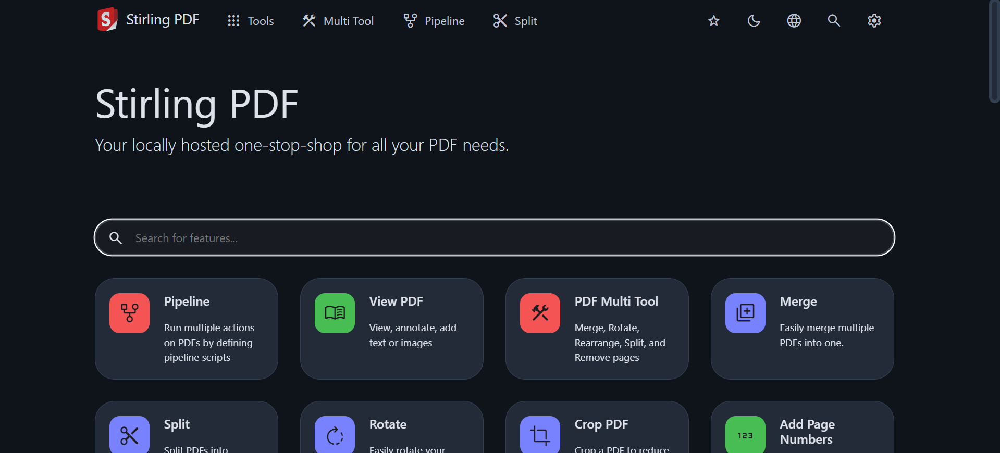

# Stirling-PDF

## Tentang
**Stirling-PDF** adalah tools berbasis web untuk melakukan berbagai operasi terhadap file PDF, seperti converting, splitting, merging, compressing, dan lain-lain.

## Instalasi
1. Login ke SSH

2. Install docker
sudo apt update
sudo apt install apt-transport-https ca-certificates curl software-properties-common
curl -fsSL https://download.docker.com/linux/ubuntu/gpg | sudo apt-key add -
sudo add-apt-repository "deb [arch=amd64] https://download.docker.com/linux/ubuntu focal stable"
sudo apt install docker-ce

3. Pull repository Stirling-PDF
docker pull frooodle/s-pdf

4. Buat container
docker run -d -p 8080:8080 -v ./trainingData:/usr/share/tessdata -v ./extraConfigs:/configs -v ./logs:/logs -e DOCKER_ENABLE_SECURITY=false -e INSTALL_BOOK_AND_ADVANCED_HTML_OPS=false -e LANGS=en_GB --name stirling-pdf frooodle/s-pdf:latest

## Cara Menggunakan
Berikut adalah tampilan utama dari websitenya
)

Kita akan coba 2 fitur yaitu PDF to Image dan Image to PDF

Untuk PDF To Image, pilih file PDF yang akan di convert menjadi Image

Selanjutnya website akan memproses PDF dan gambar akan disimpan didalam zip

Berikut hasilnya

Selanjutnya kita coba fitur Image to PDF

Untuk Image to PDF, pilih Image yang akan di convert menjadi file PDF

Selanjutnya website akan memproses gambar dan outputnya adalah downloadable PDF

Berikut hasilnya

## Pembahasan
