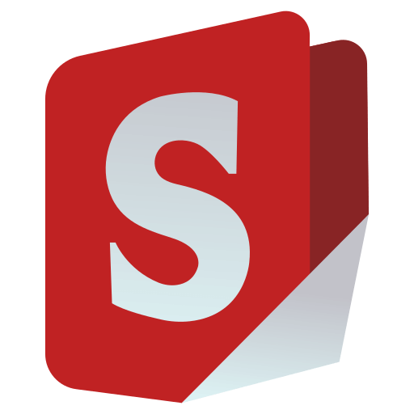

# Stirling-PDF

## Tentang
**Stirling-PDF** adalah tools berbasis web untuk melakukan berbagai operasi terhadap file PDF, seperti converting, splitting, merging, compressing, dan lain-lain.

## Instalasi
1. Login ke SSH

2. Install docker
```
sudo apt update
sudo apt install apt-transport-https ca-certificates curl software-properties-common
curl -fsSL https://download.docker.com/linux/ubuntu/gpg | sudo apt-key add -
sudo add-apt-repository "deb [arch=amd64] https://download.docker.com/linux/ubuntu focal stable"
sudo apt install docker-ce
```

3. Pull repository Stirling-PDF
```
docker pull frooodle/s-pdf
```

4. Buat container
```
docker run -d -p 8080:8080 -v ./trainingData:/usr/share/tessdata -v ./extraConfigs:/configs -v ./logs:/logs -e DOCKER_ENABLE_SECURITY=false -e INSTALL_BOOK_AND_ADVANCED_HTML_OPS=false -e LANGS=en_GB --name stirling-pdf frooodle/s-pdf:latest
```

## Cara Menggunakan
Berikut adalah tampilan utama dari websitenya


Kita akan coba 2 fitur yaitu PDF to Image dan Image to PDF


Untuk PDF To Image, pilih file PDF yang akan di convert menjadi Image


Selanjutnya website akan memproses PDF dan gambar akan disimpan didalam zip


Berikut hasilnya


Selanjutnya kita coba fitur Image to PDF, pilih Image yang akan di convert menjadi file PDF


Selanjutnya website akan memproses gambar dan outputnya adalah downloadable PDF


Berikut hasilnya


## Pembahasan
Kelebihan: 
1. Fitur Cukup Lengkap: Stirling-PDF menyediakan berbagai fitur seperti pemisahan, penggabungan, kompresi, rotasi, konversi PDF, penambahan gambar atau teks
2. Antarmuka Mudah Digunakan: Antarmukanya ramah pengguna dengan opsi mode gelap ang memungkinkan pengguna mengedit dan mengatur PDF dengan mudah
3. Gratis dan Sederhana: Stirling PDF menawarkan fitur dasar seperti kompresi, penggabungan, pemisahan, dan konversi PDF secara gratis, dengan antarmuka yang sederhana

Kekurangan:
1. Tidak tersedia konversi file dari pdf ke word
2. Tidak  Terintegrasi dengan Cloud: Stirling-PDF tidak menawarkan integrasi langsung dengan penyimpanan berbasis cloud, yang dapat menjadi kekurangan bagi pengguna yang menginginkan penyimpanan atau berbagi dokumen secara online tanpa perlu menggunakan solusi tambahan​

## Perbandingan dengan aplikasi lain (Adobe Acrobat)
Kelebihan Adobe Acrobat:
1. Fitur Lengkap dan Profesional: Adobe Acrobat adalah standar industri untuk pengeditan PDF dengan fitur pengeditan teks, gambar, formulir interaktif, anotasi, dan pengelolaan dokumen profesional.
2. Integrasi Cloud: Adobe Acrobat memiliki kemampuan untuk berbagi dokumen, berkolaborasi secara real-time, serta integrasi dengan Adobe Document Cloud.
3. Pengelolaan PDF yang Kompleks: Fitur seperti pengaturan hak akses, penandatanganan digital, dan enkripsi.

Kekurangan Adobe Acrobat:
1. Harga Mahal: Adobe Acrobat memerlukan langganan bulanan yang cukup mahal, yang mungkin tidak ekonomis bagi pengguna yang hanya membutuhkan fitur dasar
